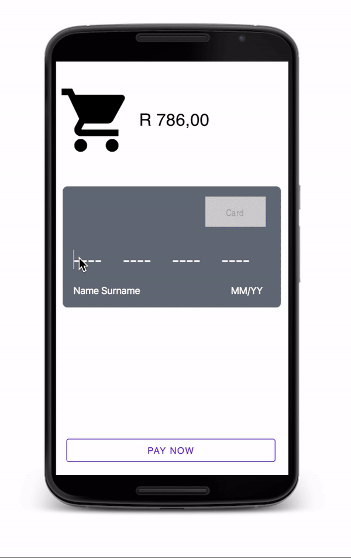

# Pay App

This is a simple pay app that validates credit card numbers using the Luhn Algorithm. As the user types, the input is masked using plain javascript. The cursor automatically tabs to the next input field as the user types and on submit, incorrect inputs are simply struck out in the UI. This challenge was done as part of the Google Certification Scholarship program.

To install:

1) Download or clone this repository using `git clone`.

2) run `npm install` to install Express.

3) run `npm start` to run the server.

